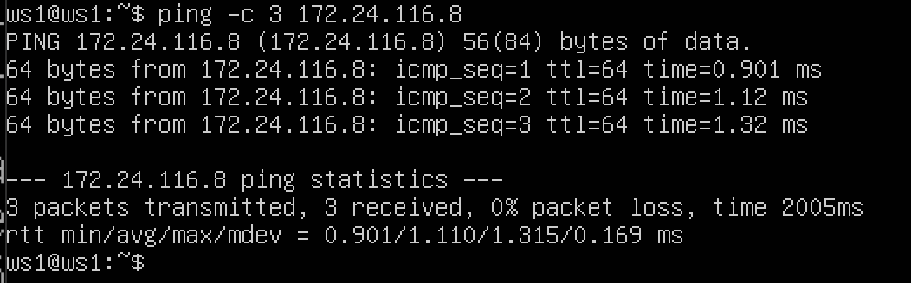
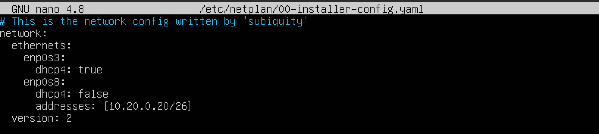
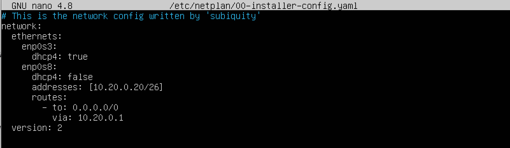
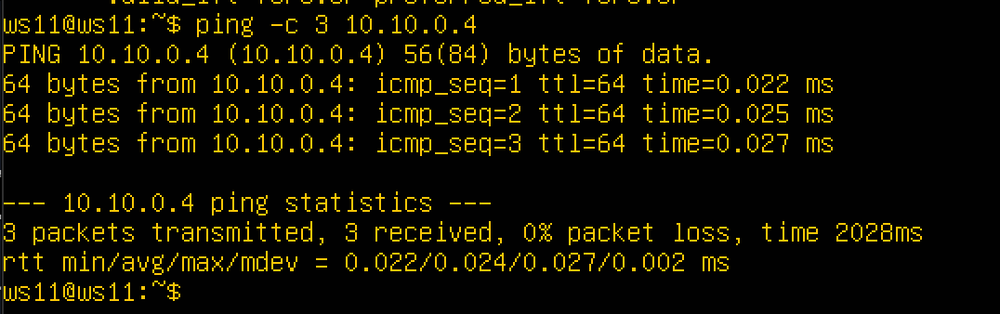

# **Report for DO2_LinuxNetwork-1**


## **Part 1. Инструмент ipcalc**

### **1.1 Сети и маски**


* 1.⠀Адрес сети 192.167.38.54/13 : 192.160.0.0/13


*Рис.1. Вывод адреса сети* 


* 2.1. Перевод маски 255.255.255.0 в двоичную запись - 11111111.11111111.11111111.00000000, в префиксную - /24


*Рис.2. вывод маски в двоичном виде и префиксном*


* 2.2. Перевод маски /15 в обычную - это 255.254.0.0, в двоичную - 11111111.11111110.00000000.00000000


*Рис.3. вывод маски в двоичном виде и обычном*


* 2.3. Перевод маски 11111111.11111111.11111111.11110000 в обычную - 255.255.255.240, в префиксную - /28


*Рис.4. вывод маски в обычном виде и префиксном*


- 3.1.⠀Минимальный и максимальный хост в сети 12.167.38.4 при масках: 
/8: минимальный хост - 12.0.0.1, максимальный - 12.255.255.254


*Рис.5. вывод минимального и максимального хоста при маске /8*


- 3.2. при маске 11111111.11111111.00000000.00000000: минимальный хост - 12.167.0.1, максимальный - 12.167.255.254


*Рис.6. вывод минимального и максимального хоста при маске 11111111.11111111.00000000.00000000*


- 3.3. при маске 255.255.254.0: минимальный хост - 12.167.38.1, максимальный - 12.167.39.254


*Рис.7. вывод минимального и максимального хоста при маске 255.255.254.0*


- 3.4. при маске /4: минимальный хост - 0.0.0.1, максимальный - 15.255.255.254


*Рис.8. вывод минимального и максимального хоста при маске /4*


### **1.2. localhost**

Определяем можно ли обратиться к приложению, работающему на localhost:

- IP: 194.34.23.100 - нельзя обратиться к приложению на localhost с этого IP


*Рис.9. С помощью команды `ipcalc`, удостоверились, что адрес - не loopback, а значит не находится в диапозоне локального хоста*


- IP: 127.0.0.2 - можно обратиться к приложению на localhost с этого IP


*Рис.10. С помощью команды `ipcalc`, удостоверились, что адрес - loopback. Это значит, что адрес находится в диапозоне локального хоста*


- IP: 127.1.0.1 - можно обратиться к приложению на localhost с этого IP


*Рис.11. Вывод `ipcalc`, адрес - loopback*


- IP: 128.0.0.1 - нельзя обратиться к приложению на localhost с этого IP


*Рис.12. Вывод `ipcalc`, адрес - не loopback*

### **1.3. Диапазоны и сегменты сетей**

1) Определяем, какие из IP можно использовать в качестве публичных, а какие только в качестве частных. 

Для этого используем команду `ipcalc` и проверяем в выведенных данных в строке Hosts/Net наличие: 'Private Internet'. Это означает, что IP относится к частной сети. Если класс Private отсутствует, то адрес публичный.

* частные IP адреса: 10.0.0.45, 192.168.4.2, 172.20.250.4, 172.16.255.255, 10.10.10.10

* публичные IP адреса: 134.43.0.2, 172.0.2.1, 192.172.0.1, 172.68.0.2, 192.169.168.1


*Рис.13. Частные IP-адреса*


*Рис.14. Частные IP-адреса*


*Рис.15. Публичные IP-адреса*


*Рис.16. Публичные IP-адреса*

2) Определяем, какие из IP-адресов шлюза возможны у сети 10.10.0.0/18

Для этого с помощью команды `ipcalc` проверяем диапазон HostMin - HostMax. Адрес шлюза сети должен в него входить. Минимальный хост - 10.10.0.1, максимальный хост: 10.10.63.254


*Рис.17. проверка диапозона хоста*

Возможные адреса:
* 10.10.0.2 
* 10.10.10.10 
* 10.10.1.255

Невозможные адреса:
* 10.10.100.1
* 10.0.0.1

## **Part 2. Статическая маршрутизация между двумя машинами**

* С помощью команды `ip a` смотрим существующие сетевые интерфейсы наших виртуальных машин


*Рис.18. сетевые интерфейсы первой машины - ws1*


*Рис.19. сетевые интерфейсы второй машины - ws2*


* **Сетевой интерфейс, соответствующий внутренней сети - enp0s8** 
MTU: 1500 
 > (Maximum Transmission Unit; максимальная единица передачи) означает максимальный размер пакета (в байтах), который может быть передан по сети без фрагментации. Если пакет будет иметь больший размер, чем установленное значение MTU, он будет фрагментироваться (разбиваться) на более мелкие. При большом количестве таких пакетов это может значительно замедлить передачу данных по сети.

> MAC-адрес (Media Access Control — надзор за доступом к среде) — уникальный идентификатор, присваиваемый каждой единице сетевого оборудования или некоторым их интерфейсам в компьютерных сетях Ethernet.

* **Настраиваем сетевые интерфейсы, с заданными адресами и масками:**

Задаем адреса и маски: ws1 - 192.168.100.10, маска /16, ws2 - 172.24.116.8, маска /12.


*Рис.20. измененный файл конфигурации /etc/netplan/00-installer-config.yaml (ws1)*


*Рис.21. измененный файл конфигурации /etc/netplan/00-installer-config.yaml (ws2)*


* Выполняем команду `sudo netplan apply`, чтобы применить новые настройки файла конфигурации 


*Рис.22. вывод выполнения команды `netplan apply` для ws1*


*Рис.23 вывод выполнения команды `netplan apply` для ws2*

### **2.1. Добавление статического маршрута вручную**

* Выполняем команду `sudo ip r add 172.24.116.8 dev enp0s8` на ws1.


*Рис.24 Добавляем статический маршрут от ws1 до ws2*


* Выполняем команду `sudo ip r add 192.168.100.10 dev enp0s8` на ws2.


*Рис.25 Добавляем статический маршрут от ws2 до ws1*


* Пропингуем ws2, командой `ping -c 3 172.24.116.8` с отправкой 5 пакетов.



*Рис.26 успешный пинг с ws2*


* Пропингуем ws1, командой `ping -c 3 192.168.100.10` с отправкой 5 пакетов.


*Рис.27 успешный пинг с ws1*

Таким образом, мы удостоверились, что компьютеры успешно обмениваются данными друг с другом.

### **2.2. Добавление статического маршрута с сохранением**

* Перезапускаем машины командой `sudo reboot`

* Редактируем содержимое файла /etc/netplan/00-installer-config.yaml. для машины ws1 и ws2


*Рис.28 отредактированный файл ws1 /etc/netplan/00-installer-config.yaml*


*Рис.29 отредактированный файл ws2 /etc/netplan/00-installer-config.yaml*


* Проверяем успешность добавления статического маршрута. Для этого пропингуем ws1, командой `ping -c 3 172.24.116.8` с отправкой 3 пакетов.


*Рис.30 успешный пинг с ws1*


* Пропингуем ws2, командой `ping -c 3 192.168.100.10` с отправкой 3 пакетов.


*Рис.31 успешный пинг с ws2*

## **Part 3.  Утилита iperf3**

### **3.1. Скорость соединения**

* Переводим заданные скорости: 8 Mbps в MB/s, 100 MB/s в Kbps, 1 Gbps в Mbps.

>Mbps - Megabit per second - Мегабит в секунду;

>MB/s - Megabyte per second - Мегабайт в секунду (1 MB/s = 8 Mbps);

>Kbps - Kilobits per second - Килобит в секунду (1 Kbps = 0.000125 MB/s);

>Gbps - Gigabits per second - Гигабит в секунду (1 Gbps = 125 MB/s);

8 Mbps = 1 MB/s
100 MB/s = 800000 Kbps
1 Gbps = 1000 Mbps

### **3.2. Утилита iperf3**

* Определяем скорость соединения между машинами ws1 и ws2. На ws1 запускаем сервер утилиты iperf3 с помощью команды `iperf3 -s`, чтобы машина принимала входящее соединение.


*Рис.32 вывод команды `iperf3 -s`*

* Выполняем команду `iperf3 -c 192.168.100.10` на ws2, чтобы настроить её как клиент и измерить скорость соединения между машинами.
Средняя скорость соединения между машинами: 1.32  Gbits/sec.


*Рис.33 вывод команды `iperf3 -с`*

## **Part 4. Сетевой экран**

### **4.1. Утилита iptables**

* Создаем файл /etc/firewall.sh, имитирующий файрвол, на ws1 и ws2 с удалением всех правил в таблице «filter» (по-умолчанию). Открываем на машинах доступ для порта 22 (ssh) и порта 80 (http).

* На ws1 применяем стратегию, когда в начале пишется запрещающее правило, а в конце пишется разрешающее правило (правило: echo reply - пинг)


*Рис.34 Настроенный файл /etc/firewall.sh (ws1)*


* На ws2 применяем стратегию, когда в начале пишется разрешающее правило, а в конце пишется запрещающее правило (правило: echo reply - пинг)


*Рис.35 Настроенный файл /etc/firewall.sh (ws2)*

* Запускаем файл на машине ws1 командами `chmod +x /etc/firewall.sh` и `/etc/firewall.sh`


* Запускаем файл на машине ws2 командами `chmod +x /etc/firewall.sh` и `/etc/firewall.sh`


> * Разница между стратегиями состоит в порядке разрешающих и запрещающих правил. Так как учитывается только первое встречаемое пакетом подходящее правило, то первая машина не может быть пропингована второй. Вторая же машина напротив может дать ответ на пинг, посколько цель ACCEPT находится выше цели DROP.

### **4.2. Утилита nmap**

* Проверим, какая из машин пингуется 


*Рис.36 ws2  ожидаемо не пингуется из-за настроек файла /etc/firewall.sh*


*Рис.37 ws1  успешно пингуется*

* С помощью команды на ws2 `nmap ip ws1` удостоверились, хост машины запущен


*Рис.38 Проверка сообщения, что: Host is up*

## **Part 5. Статическая маршрутизация сети**

* Поднимаем 5 виртуальных машин (3 рабочие станции: ws11, ws21, ws22 и 2 роутера: r1, r2). Версия - Ubuntu 20.04.6 LTS.

### **5.1. Настройка адресов машин**

* Вносим новые настройки согласно схеме сети в файл конфигурации netplan


*Рис.39 схема сети*


* Настраиваем конфигурации сети на ws11.


*Рис.40 Содержимое файла /etc/netplan/00-installer-config.yaml для машины ws11*


* Настраиваем конфигурации сети на ws21.


*Рис.41 Содержимое файла /etc/netplan/00-installer-config.yaml для машины ws21*


* Настраиваем конфигурации сети на ws22.



*Рис.42 Содержимое файла /etc/netplan/00-installer-config.yaml для машины ws22*


* Настраиваем конфигурации сети на r1.


*Рис.43 Содержимое файла /etc/netplan/00-installer-config.yaml для машины r1*


* Настраиваем конфигурации сети на r2.


*Рис.44 Содержимое файла /etc/netplan/00-installer-config.yaml для машины r2*


* Перезапускаем сетевую службу через `sudo netplan apply` на всех машинах. Командой `ip -4 a` проверяем, что адресы машин заданы верно. ws11:


*Рис.45 Адрес интерфейса enp0s8 задан верно: 10.10.0.2/18*

> Основная цель команды ip -4 addr - это показать список всех сетевых интерфейсов и их соответствующие IP-адреса IPv4.

* ws21:


*Рис.46 Адрес интерфейса enp0s8 задан верно: 10.20.0.10/26.*


* ws22:


*Рис.47 Адрес интерфейса enp0s8 задан верно: 10.20.0.20/26*


* r1:


*Рис.48 Адреса интерфейсов enp0s8 и enp0s9 заданы верно: 10.10.0.1/18, 10.100.0.11/16.*


* r2:


*Рис.49 Адреса интерфейсов enp0s8 и enp0s9 заданы верно: 10.100.0.12/16, 10.20.0.1/26. *


* Пропинговали ws22 с ws21 командой `ping -c 3 10.20.0.20`


*Рис.50 Успешный пинг ws22 с ws21*


* Пропинговали r1 с ws11 командой `ping -c 3 10.10.0.1`


*Рис.51 Успешный пинг r1 с ws11*

### **5.2. Включение переадресации IP-адресов**

* Выполняем команду `sudo sysctl -w net.ipv4.ip_forward=1` на роутерах r1, r2, чтобы включить временную переадресацию IP (до перезапуска системы).


*Рис.52 Запуск и вывод команды  `sudo sysctl -w net.ipv4.ip_forward=1` на r1*


*Рис.53 Запуск и вывод команды  `sudo sysctl -w net.ipv4.ip_forward=1` на r2*

* Открываем файл /etc/sysctl.conf на роутерах. Добавляем в файл строку `net.ipv4.ip_forward = 1` для включения IP-переадресации на постоянной основе.


*Рис.54 Отредактированный файл /etc/sysctl.conf на r1*


*Рис.55 Отредактированный файл /etc/sysctl.conf на r2*

### **5.3. Установка маршрута по умолчанию**

*  Настраиваем маршрут по умолчанию (шлюз) для рабочих станций. Для этого добавляем default (0.0.0.0/0) перед IP роутера в файле конфигураций etc/netplan/00-installer-config.yaml на ws11, ws21, ws22.


*Рис.56 Отредактированный файл etc/netplan/00-installer-config.yaml на ws11. Адрес 0.0.0.0/0 является default в таблице маршрутизации*


*Рис.57 Отредактированный файл etc/netplan/00-installer-config.yaml на ws21*



*Рис.58 Отредактированный файл etc/netplan/00-installer-config.yaml на ws22*

* Вызываем `ip r` и показываем, что добавился маршрут в таблицу маршрутизации


*Рис.59 Вывод `ip r` на ws11*


*Рис.60 Вывод `ip r`  на ws21*


*Рис.61 Вывод `ip r` на ws22*

* Пингуем с ws11 роутер r2 и показываем на r2, что пинг доходит. Для этого используем команду:
`tcpdump -tn -i enp0s8`


*Рис.62 Пинг с ws11 и r2*


*Рис.63 Проверка, что пинг доходит до r2*

>10.10.0.2 > 10.100.0.12: ICMP echo request: Это строка показывает, что пакет ICMP (пинг) отправляется от IP-адреса 10.10.0.2 (ws11) к IP-адресу 10.100.0.12 (r2).

>id 8, seq 35, length 64: Эти параметры указывают на идентификатор ICMP запроса, номер последовательности и длину пакета.

### **5.4. Добавление статических маршрутов**
c
* Добавляем в роутеры r1 и r2 статические маршруты в сетку 10.20.0.0/26 в файле конфигураций. 


*Рис.64 Отредактированный файл конфигурации /etc/netplan/00-installer-config.yaml (r1)*


*Рис.65 Отредактированный файл конфигурации /etc/netplan/00-installer-config.yaml (r2)*

* Выполняем команду `ip r` на r1.


*Рис.66 Сетевой статический маршрут к сети 10.20.0.0/26 установился по-заданному шлюзу 10.100.0.12*


* Выполняем команду `ip r` на r2.


*Рис.67 Сетевой статический маршрут к сети 10.10.0.0/18 установился по-заданному шлюзу 10.100.0.11*


* Выполняем команды `ip r list 10.10.0.0/18` и `ip r list 0.0.0.0/0` на ws11.


*Рис.68 Вывод команд `ip r list 10.10.0.0/18` и `ip r list 0.0.0.0/0` на машине ws11*

> После вызова команд `ip r list 10.10.0.0/18` и `ip r list 0.0.0.0/0` на машине ws11 отобразились разные результаты из-за разницы приоритета маршрутов. Для сети 10.10.0.0 мы создали правило, и поэтому для нее используется созданный маршрут. Когда же не найден подходящий маршрут в таблице маршрутизации, то используется маршрут по умолчанию.


### **5.5. Построение списка маршрутизаторов**

* Выполняем команду `sudo tcpdump -tnv -i enp0s8` на r1.


*Рис.69 Вызов команды на r1*


*Рис.69 Вывод команды `sudo tcpdump -tnv -i enp0s8` (r1)*


* Выполняем команду `traceroute 10.20.0.10`(ip ws21) на ws11.


*Рис.70  Вывод команды `traceroute 10.20.0.10` на ws11.*

> Traceroute используется для отслеживания маршрута пакетов данных от отправителя до целевого сервера.

> Принцип работы traceroute: утилита отправляет целевому узлу несколько пакетов с временем жизни 1 (TTL, time to live - число переходов, которые пакет может осуществить до своего исчезновения). Следующий маршрутизатор принимает пакеты и отправляет сообщение, что время жизни пакетов истекло. traceroute фиксирует адрес этого маршрутизатора и отправляет следующие пакеты, уже с TTL 2. Так, каждый раз увеличивая TTL на 1, traceroute составляет список маршрутизаторов, через которе прошли пакеты до целевого узла. В конце процесса traceroute выводит список всех промежуточных узлов (маршрутизаторов), а также время, затраченное на прохождение через каждый из них.

### **5.6. Использование протокола ICMP при маршрутизации**

* Запускаем на r1 перехват сетевого трафика, проходящего через enp0s8 с помощью команды `tcpdump -n -i enp0s8 icmp` и пингуем несуществующий ip из ws11 


*Рис.71  Вывод команды `tcpdump -n -i enp0s8 icmp` на r1*


*Рис.72  Вывод команды `ping 10.30.0.111` на ws11*

> Протокол ICMP (Internet Control Message Protocol) — это сетевой протокол, который используется для передачи сообщений об ошибках и управляющих сообщений в IP-сетях. Он является частью набора протоколов семейства IP и работает на сетевом уровне модели OSI.

* Сохранила дампы образов виртуальных машин для следующих заданий.

## **Part 6. Динамическая настройка IP с помощью DHCP**

* Для r2 настраиваем в файле /etc/dhcp/dhcpd.conf конфигурацию службы DHCP. Для начала скачиваем isc-dhcp-server: `sudo apt install isc-dhcp-server`. Указываем адрес маршрутизатора по-умолчанию, DNS-сервер и адрес внутренней сети.


*Рис.73 Измененный файл /etc/dhcp/dhcpd.conf на машине r2*

* В файле resolv.conf прописываем nameserver 8.8.8.8


*Рис.74 Измененный файл /etc/resolv.conf на машине r2*

> Назначение файла /etc/resolv.conf:
>* Хранение информации о DNS-серверах:
Файл содержит список IP-адресов DNS-серверов, которые система будет использовать для разрешения имен в IP-адреса.
>* Настройка зоны поиска:
Определяет зону поиска по умолчанию для DNS-запросов.
>* Конфигурация других параметров DNS:
Может содержать дополнительные опции и параметры для управления процессом разрешения имен.

* Перезагружаем службу DHCP командой `systemctl restart isc-dhcp-server`. 


*Рис.75 Вызов и вывод команды `systemctl restart isc-dhcp-server` на машине r2*

* Изменим настройки машин ws21 и ws22 в файле конфигурации, чтобы сделать протокол DHCP активным. На каждой машине введём `sudo nano /etc/netplan/00-installer-config.yaml` и `sudo netplan apply`.


*Рис.76  Изменили 00-installer-config.yaml на машине ws21*


*Рис.77  Изменили 00-installer-config.yaml на машине ws22*


* Машину ws21 перезагружаем при помощи `reboot`. 


*Рис.78  Вызов `sudo reboot` на машине ws21*


* Через `ip a` показываем, что  ws21 получила присвоенный адрес.


*Рис.79 Вызов и вывод `ip a` на ws21*


* Пингуем ws22 с ws21.


*Рис.80 Успешный пинг ws22 и присвоенного адреса ws21*


* Указываем MAC-адрес у ws11. Для этого в etc/netplan/00-installer-config.yaml  добавляем строки: macaddress: 10:10:10:10:10:BA, dhcp4: true


*Рис.81 Отредактированный etc/netplan/00-installer-config на ws11*

* Для r1 настраиваем аналогично r2, но делаем выдачу адресов с жесткой привязкой к MAC-адресу (ws11).


*Рис.82 Отредактированный /etc/dhcp/dhcpd.conf на r1*

* Редактируем /etc/resolv.conf на r1.


*Рис.83 Отредактированный /etc/resolv.conf на r1*

* Перезагружаем службу DHCP.


*Рис.84 Вывод команды `systemctl restart isc-dhcp-server` на r1*

* Перезагружаем ws11 и вызываем `ip a`


*Рис.85 Вызов и вывод `ip a` на ws11*

* Пингуем ws22 с ws11.



*Рис.86 Успешный пинг ws22 и присвоенного адреса ws11*

* Проверяем IP до обновления на ws21.


*Рис.87 вывод команды `ip a` (ws21)*

* Запросим с ws21 обновление ip адреса. Вызываем команду `sudo dhclient enp0s8 -r` (для явного освобождения текущей аренды ip адреса), потом `sudo dhclient enp0s8` и снова `ip a` для проверки обновления ip.


*Рис.88 Освобождение и добавления ip на ws21*

* Сохраняем дампы образов виртуальных машин.

## Part 7. **NAT**

Для работы с сервером apache2, установим его на машины r1, r2 и ws22. Возможно apache2 не будет устанавливаться, тогда возможно поможет обновление системы (см. ниже).

>`sudo apt install apache2`

Обновление системы:
>`sudo apt update`

>`sudo apt upgrade -y`
-y - при запросе сразу согласиться с  установкой.
*В данном задании используются виртуальные машины из Части 5.*
##### В файле */etc/apache2/ports.conf* на ws22 и r1 измени строку `Listen 80` на `Listen 0.0.0.0:80`, то есть сделай сервер Apache2 общедоступным.
В отчёт помести скрин с содержанием изменённого файла.

- сделаем сервер общедоступным, поменяв строку Listen 80 на Listen 0.0.0.0:80

> `sudo nano /etc/apache2/ports.conf`

   ws22:
   
   r1:
   

##### Запусти веб-сервер Apache командой `service apache2 start` на ws22 и r1.
В отчёт помести скрины с вызовом и выводом использованной команды.

- запустим веб-сервер Apache командой на ws22 и r1

>`service apache2 start`

ws22:
  

r1:
  

##### Добавь в фаервол, созданный по аналогии с фаерволом из Части 4, на r2 следующие правила:
##### 1) Удаление правил в таблице filter - `iptables -F`;
##### 2) Удаление правил в таблице "NAT" - `iptables -F -t nat`;
##### 3) Отбрасывать все маршрутизируемые пакеты - `iptables --policy FORWARD DROP`.

   - добавим в firewall новые правила, командой:
   > `sudo nano /etc/firewall.sh`
   r2:
   

##### Запусти файл также, как в Части 4.
##### Проверь соединение между ws22 и r1 командой `ping`.
*При запуске файла с этими правилами, ws22 не должна «пинговаться» с r1.*
В отчёт помести скрины с вызовом и выводом использованной команды.
При запуске файла firewall.sh с этими правилами, ws22 не должна "пинговаться" с r1.

   - пропингуем ws22 с r1, командой: 
   >`ping -c 3 10.20.0.20`
   

   - пропингуем r1 с ws22, командой: 
   >`ping -c 3 10.100.0.11` 
   

##### Добавь в файл ещё одно правило:
##### 4) Разрешить маршрутизацию всех пакетов протокола **ICMP**.

   - дополним firewall новым правилом, разрешить маршрутизацию всех пакетов типа forward, командой: > `sudo nano /etc/firewall.sh`
   
   r2:
   

##### Запусти файл также, как в Части 4.
##### Проверь соединение между ws22 и r1 командой `ping`.
*При запуске файла с этими правилами, ws22 должна «пинговаться» с r1.*
- В отчёт помести скрины с вызовом и выводом использованной команды.

   - пропингуем ws22 с r1, командой: 

   >`ping -c 3 10.20.0.20`

   

   - пропингуем r1 с ws22, командой: 

   >`ping -c 3 10.100.0.11`
   

##### Добавь в файл ещё два правила:
##### 5) Включи **SNAT**, а именно маскирование всех локальных ip из локальной сети, находящейся за r2 (по обозначениям из Части 5 - сеть 10.20.0.0).
*Совет: стоит подумать о маршрутизации внутренних пакетов, а также внешних пакетов с установленным соединением.*
```- Все работает очень просто. Компьютер имеет свой адрес в локальной сети, он не виден из интернета. Когда ему нужно отправить пакет, он отправляет его роутеру, затем роутер подменяет адрес отправителя на свой и передает пакет дальше к цели. Параллельно роутер запоминает с какого локального компьютера был отправлен пакет на этот адрес. Дальше ответный пакет приходит роутеру, он подменяет адрес назначения на адрес нужного компьютера и отдает пакет в локальную сеть.

- Недостаток в том, что инициировать подключение извне нельзя, потому что маршрутизатор просто еще не знает к кому обращаются. Тут на помощь приходит проброс портов. Мы можем сказать роутеру: при поступлении пакетов на порт 80 перенаправлять их на порт 80 компьютера 192.168.1.2. Теперь адрес отправителя и порт будет заменяться на указанный нами и пакет будет передан туда, куда нужно. Если на маршрутизаторе установлен Linux, то все это можно настроить с помощью iptables.


- nat - обеспечивает работу nat, если вы хотите использовать компьютер в качестве маршрутизатора;
- filter - основная таблица для фильтрации пакетов, используется по умолчанию.

- Действие ACCEPT означает, что мы разрешаем это соединение. Но это правило разрешает только первый пакет, а нам нужно пропускать любой следующий трафик в обоих направлениях, поэтому добавим правила для ESTABLIHED.

- prerouting - в эту цепочку пакет попадает перед обработкой iptables, система еще не знает куда он будет отправлен, в input, output или forward;
postrouting - сюда попадают все проходящие пакеты, которые уже прошли цепочку forward.

-A - добавить правило в цепочку;
-F - очистить все правила;
-p - указать протокол, один из tcp, udp, udplite, icmp, icmpv6,esp, ah, sctp, mh;
-o - исходящий сетевой интерфейс;
-j - выбрать действие, если правило подошло.
-i - входной сетевой интерфейс;
-s - указать ip адрес устройства-отправителя пакета;
--policy используется для установки политики (правил поведения по умолчанию) 

state --state используется вместе с командой iptables для фильтрации пакетов на основе их состояния соединения. Это используется для определения текущего состояния соединения, такого как ESTABLISHED, RELATED, NEW или INVALID.

SNAT (Source NAT) - это одна из возможностей Netfilter, используемая для изменения исходного адреса (source address) и/или порта (source port) пакетов, проходящих через брандмауэр. Это полезно, когда требуется изменить адрес отправителя пакета, например, когда внутренние узлы сети должны использовать один общий внешний IP-адрес для связи с внешним миром.

В скрипте firewall.sh в Linux, правило SNAT может быть использовано для изменения исходного адреса отправителя пакета. Например, для того чтобы перенаправить все пакеты с определенного исходного адреса на другой адрес, вы можете использовать команду следующего вида:

iptables -t nat -A POSTROUTING -s <source_address> -j SNAT --to <new_source_address>
```
Включаем SNAT, а именно маскирование всех локальных ip из локальной сети, находящейся за r2 (по обозначениям из Части 5 - сеть 10.20.0.0)

   - добавляем в файл ещё два правила, командой:
     > `sudo nano /etc/firewall.sh`
   

##### 6) Включи **DNAT** на 8080 порт машины r2 и добавить к веб-серверу Apache, запущенному на ws22, доступ извне сети.
*Совет: стоит учесть, что при попытке подключения возникнет новое tcp-соединение, предназначенное ws22 и 80 порту.*
В отчёт помести скрин с содержанием изменённого файла.

```
DNAT (Destination NAT) - это функция Netfilter, которая используется для изменения целевого адреса (destination address) и/или порта (destination port) пакетов, проходящих через брандмауэр. DNAT применяется при необходимости перенаправления входящих пакетов на другой адрес или порт.

В скрипте firewall.sh в Linux, правило DNAT может использоваться для перенаправления пакетов на другой адрес или порт. Например, для перенаправления всех входящих пакетов с определенного порта на другой адрес и порт, вы можете использовать команду следующего вида:

Bash

iptables -t nat -A PREROUTING -p <protocol> --dport <original_port> -j DNAT --to-destination <new_address>:<new_port>
Где:
- -t nat указывает, что правило применяется к таблице NAT.
- -A PREROUTING добавляет правило в цепочку PREROUTING, которая применяется к пакетам до их маршрутизации.
- -p <protocol> указывает на протокол пакета (например, TCP или UDP).
- --dport <original_port> указывает на оригинальный порт (порт назначения) пакета.
- -j DNAT указывает, что должно быть применено действие DNAT.
- --to-destination <new_address>:<new_port> указывает новый адрес и порт, на который будет перенаправлен пакет.

Это позволяет настроить перенаправление входящего трафика на определенный адрес и порт в сети, что является полезной функцией для реализации веб-прокси, виртуальных хостов или других сетевых служб.
```
- включим DNAT на 8080 порт машины r2 и добавим к веб-серверу Apache, запущенному на ws22, доступ извне сети (хостам из интернета), командой:
  > `sudo nano /etc/apache2/ports.conf`
   
   

**NAT** — это аббревиатура для преобразования сетевых адресов.
| ПАРАМЕТР               | **SNАТ**                                                                                                                                                                                                                  | **DNAT**                                                                                                                                                                                                                                                                               |
| ---------------------- | ------------------------------------------------------------------------------------------------------------------------------------------------------------------------------------------------------------------------- | -------------------------------------------------------------------------------------------------------------------------------------------------------------------------------------------------------------------------------------------------------------------------------------- |
| Аббревиатура           | источник **NAT**                                                                                                                                                                                                          | назначение **NAT**                                                                                                                                                                                                                                                                     |
| Терминология           | **SNAT** изменяет частный IP-адрес исходного хоста на общедоступный IP-адрес. Он также может изменить исходный порт в заголовках TCP/UDP. **SNAT** обычно используется внутренними пользователями для доступа в Интернет. | Назначение **NAT** изменяет адрес назначения в IP-заголовке пакета. Он также может изменить порт назначения в заголовках TCP/UDP. **DNAT** используется, когда нам нужно перенаправить входящие пакеты с общедоступным адресом/портом на частный IP-адрес/порт внутри внутренней сети. |
| Пример использования   | Клиент внутри локальной сети и за брандмауэром хотел просматривать Интернет                                                                                                                                               | Веб-сайт, размещенный в центре обработки данных за брандмауэром, и должен быть доступен для пользователей через Интернет                                                                                                                                                               |
| Изменение адреса       | **SNAT** изменяет адрес источника пакетов, проходящих через устройство **NAT**                                                                                                                                            | **DNAT** изменяет адрес назначения пакетов, проходящих через маршрутизатор.                                                                                                                                                                                                            |
| Порядок работы         | **SNAT** выполняется после принятия решения о маршрутизации.                                                                                                                                                              | **DNAT** выполняется до принятия решения о маршрутизации.                                                                                                                                                                                                                              |
| Коммуникационный поток | Когда внутренняя защищённая сеть инициирует связь с внешним миром, происходит **SNAT**                                                                                                                                    | Когда внешняя незащищенная сеть инициирует связь с внутренней защищенной сетью, происходит **DNAT**.                                                                                                                                                                                   |
| Один/несколько хостов  | **SNAT** позволяет использовать несколько хостов во «внутренней» сети для доступа к любому хосту во «внешней» сети                                                                                                        | **DNAT** позволяет любому хосту во «внешней» сети получить доступ к одному хосту во «внутренней» сети                                                                                                                                                                                  |


##### Запусти файл также, как в Части 4.
   
*Перед тестированием рекомендуется отключить сетевой интерфейс **NAT** (его наличие можно проверить командой `ip a`) в VirtualBox, если он включен.*
##### Проверь соединение по TCP для **SNAT**: для этого с ws22 подключиться к серверу Apache на r1 командой:
`telnet [адрес] [порт]`
   
   Проверим соединение по TCP для SNAT, для этого с ws22 подключаемся к серверу Apache, командой:
> `telnet 10.100.0.11 80`
   


##### Проверь соединение по TCP для **DNAT**: для этого с r1 подключиться к серверу Apache на ws22 командой `telnet` (обращаться по адресу r2 и порту 8080).
В отчёт помести скрины с вызовом и выводом использованных команд.

- проверим соединение по TCP для DNAT, для этого с r1 подключимся к серверу Apache на ws22 (обращаться по адресу r2 и порту 8080), командой:
  >`telnet 10.100.0.12 8080`
  

## Part 8. Дополнительно. Знакомство с **SSH Tunnels**
*В данном задании используются виртуальные машины из Части 5.*
##### Запусти на r2 фаервол с правилами из Части 7.

##### Запусти веб-сервер **Apache** на ws22 только на localhost (то есть в файле */etc/apache2/ports.conf* измени строку `Listen 80` на `Listen localhost:80`).

   1. на нужных машинах apache2 не стоит и его нужно установить. Однако перед установкой желательно обновить систему:

   > `sudo apt update`
   > `sudo apt upgrade -y`
   -y - при запросе сразу согласиться с установкой.

   2. устанавливаем apache2

   > `sudo apt install apache2`

   3. Запускаем веб-сервер Apache на ws22 только на localhost (то есть в файле /etc/apache2/ports.conf изменить строку Listen 80 на Listen localhost:80)

   > `sudo nano /etc/apache2/ports.conf`
   .png)


> `!!! Обязательно установить ssh на машины !!! 
sudo apt install ssh`

##### Воспользуйся Local TCP forwarding с ws21 до ws22, чтобы получить доступ к веб-серверу на ws22 с ws21.

` ssh -L 8080:10.20.0.20:80 ws21@localhost ` - команда для Local TCP

.png)

##### Воспользуйся Remote TCP forwarding c ws11 до ws22, чтобы получить доступ к веб-серверу на ws22 с ws11.

` ssh -R 8080:10.20.0.20:80 ws11@localhost `- команда для Remote TCP

.png)

##### Для проверки, сработало ли подключение в обоих предыдущих пунктах, перейди во второй терминал (например, клавишами Alt + F2) и выполни команду:

.png)

.png)